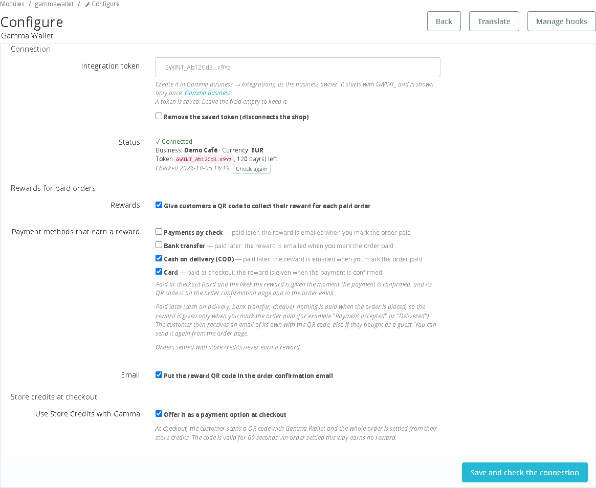
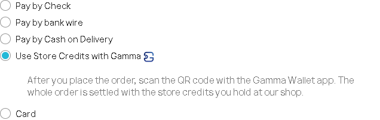
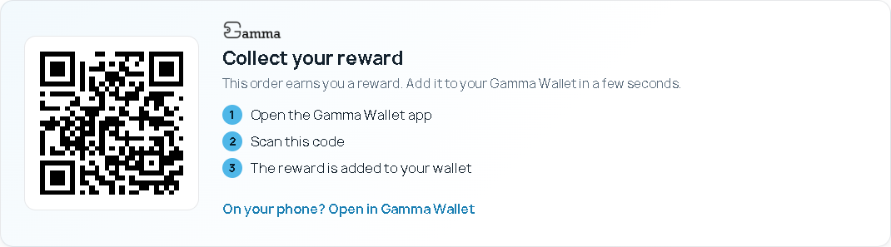
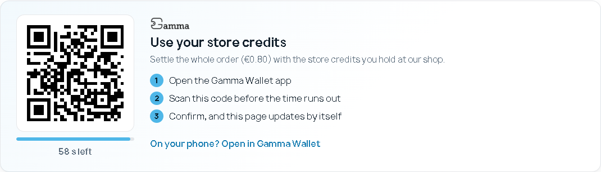
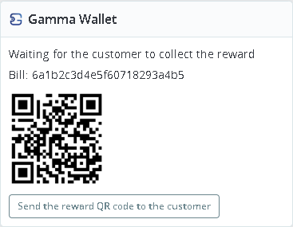

# Gamma Wallet for PrestaShop

Use [Gamma Wallet](https://www.gamma-wallet.com) in your PrestaShop shop. Once the module is installed:

- **Your customers earn a reward for every paid order.** After paying, they scan a QR code with the Gamma Wallet app and the reward is added to their wallet, under your business.
- **Your customers can use the store credits they hold at your shop.** At checkout they choose *Use Store Credits with Gamma*, scan a QR code, and the whole order is settled from their credits.

Credits are a promise of value at your business. They are not money and not crypto, and Gamma never handles any payment. Card payments, cash on delivery and the rest keep working exactly as they do today.

This guide is for shop owners. No coding is needed. If you want to connect your own software instead of PrestaShop, see [byCode](https://github.com/Gamma-Wallet/Integrations-samples-/tree/main/byCode).

---

## Contents

1. [What you need](#1-what-you-need)
2. [Install the module](#2-install-the-module)
3. [Create your integration token in Gamma Business](#3-create-your-integration-token-in-gamma-business)
4. [Connect your shop](#4-connect-your-shop)
5. [Choose which orders earn a reward](#5-choose-which-orders-earn-a-reward)
6. [Store credits at checkout](#6-store-credits-at-checkout)
7. [What your customers see](#7-what-your-customers-see)
8. [Your orders](#8-your-orders)
9. [Renewing your token](#9-renewing-your-token)
10. [Questions and answers](#10-questions-and-answers)
11. [When something is wrong](#11-when-something-is-wrong)

---

## 1. What you need

| | |
|---|---|
| A Gamma Business account with a **Reward** service active | [Register](https://business.gamma-wallet.com) and start on the free tier, then activate a Reward service. The module works only with a Reward service: while another kind of service is active (a membership or a discount card, for example), customers get no reward QR code and store credits are not offered at checkout. |
| PrestaShop | Version 8 or 9. Tested with PrestaShop 8.2 (*Classic* theme) and PrestaShop 9.2 (*Hummingbird* theme). |
| PHP | Version 7.2 or newer, as PrestaShop 8 itself requires. Your hosting provider can tell you which version you have. |
| The same currency | Your shop must sell in the same currency as your Gamma business (for example EUR in both). |

## 2. Install the module

1. Download **[gammawallet.zip](gammawallet.zip)** (on GitHub, open the file and click *Download raw file*).
2. In your PrestaShop back office, go to **Modules → Module Manager** and click **Upload a module**.
3. Drop the zip file in the window. PrestaShop installs the module and offers to configure it.

You find it again later in **Modules → Module Manager**, under the name **Gamma Wallet**, with a **Configure** button.

Only orders placed **after** the module is installed earn rewards; older orders never do.

**Updating to a new version:** upload the new zip the same way. PrestaShop sees the newer version and offers **Upgrade**.

## 3. Create your integration token in Gamma Business

The token is the key that lets your shop talk to your Gamma business. You never give the module your password.

1. Sign in to [Gamma Business](https://business.gamma-wallet.com) as the business owner.
2. Open **Integrations**.
3. Click **Create token** and choose how long it stays valid (up to one year).
4. **Copy the token now.** It starts with `GWINT_` and is shown only once.

Keep the token private, like a password. Anyone who has it can create rewards for your business. If you think it has leaked, disable it in **Integrations** and create a new one.

## 4. Connect your shop

1. In **Modules → Module Manager**, click **Configure** next to Gamma Wallet.
2. Paste the token into **Integration token**.
3. Click **Save and check the connection**.

Under **Status** you should now see **✓ Connected**, your business name, your currency and how many days the token has left. If a red line says your business has no Reward service active, activate one in Gamma Business, then click **Check again**.

The token field stays empty after saving; that is on purpose, so the token can't be read back from the page. Only its first and last characters are shown. To change it, paste a new one. To disconnect the shop, tick **Remove the saved token**.

## 5. Choose which orders earn a reward

Under **Rewards for paid orders**:

- **Rewards**: turns rewards on or off for the whole shop.
- **Payment methods that earn a reward**: one tick box for each payment module your shop has.
- **Email**: puts the reward QR code in the order confirmation email as well as on the order confirmation page.

The rule behind the tick boxes is simple: **a reward is given only for money you have actually received.** In PrestaShop that means the order is in a *paid* status, such as **Payment accepted**.

| Payment method | When the reward is given | Where the customer finds the QR code |
|---|---|---|
| Paid at checkout (card, PayPal and the like) | As soon as the payment is confirmed | On the order confirmation page, on their order page and in the order confirmation email |
| Paid later: cash on delivery, bank transfer, cheque | Only when **you** move the order to a paid status (for example **Payment accepted**), meaning you have received the money | In an email of its own, sent once at that moment, and on their order page |
| Store credits (*Use Store Credits with Gamma*) | Never: the customer used their credits rather than paying | — |

Payment modules for online payments are ticked by default. Cash on delivery, bank transfer and cheque are not; tick them if you want those orders to earn a reward once they are paid.

The reward the customer receives follows the Reward service you have active in Gamma Business. You don't set amounts in PrestaShop.

## 6. Store credits at checkout

*Use Store Credits with Gamma* is on as soon as the module is installed. You can turn it off under **Store credits at checkout** on the settings page. Customers see it among the payment options:

Good to know:

- Store credits always cover the **whole** order. A customer who doesn't hold enough credits at your shop can't complete it with their credits and chooses another payment method instead.
- The option is shown only when your shop is connected, your business has a Reward service active, the currency matches and the order total is above zero.
- An order settled with store credits doesn't earn a new reward.
- Like every payment module, it follows PrestaShop's **Payment → Preferences**: if you limit payment modules by currency, country, customer group or carrier there, include Gamma Wallet where you want it offered.
- It is not offered for a cart that PrestaShop would split into several orders (several carriers or delivery addresses), because store credits settle one whole order.
- If the customer confirms in the app and closes the page straight away, the order is still settled: the module checks waiting orders with Gamma while you use the back office, and when you open the order. For it to happen every few minutes in any case, copy the **Cron task** address from the settings page into the *Cron tasks manager* module or your server's crontab.
- If an order is paid with credits after it was cancelled, it is not changed: you find a private note on the order, because the customer has used their credits.

## 7. What your customers see

### An order paid at checkout

The order confirmation page shows the reward. The customer opens the Gamma Wallet app, scans the code, and the reward is added to their wallet. The same code is in their order confirmation email and on their order page, so they can scan it later from another device.

On a phone, *Open in Gamma Wallet* opens the same reward without scanning.

### An order paid on delivery

At checkout and in the order emails there is no reward yet, because nothing has been paid. The confirmation page only says that a QR code will follow by email. When the parcel is delivered and paid, you move the order to **Payment accepted**. The customer then receives an email with the subject *Your reward from (your shop) (order …)* containing the QR code.

### An order settled with store credits

After placing the order, the customer sees a QR code with a countdown. They scan it with the Gamma Wallet app and confirm. The page updates by itself and the order moves to **Payment accepted**, like an order paid by card.

Each code is valid for **60 seconds**. If time runs out, the customer gets a button to show a new code. Until the customer confirms, the order stays in the status **Awaiting Gamma store credits**, which the module adds to your shop.

### Guests

Customers don't need an account in your shop. The reward QR code is on the confirmation page and in the email that goes to the address they gave at checkout, and on PrestaShop's guest order tracking page. They only need the free Gamma Wallet app.

## 8. Your orders

Every order has a **Gamma Wallet** box on its page in **Orders → Orders**. It tells you where things stand:

- *Waiting for the customer to collect the reward*, with the QR code (you can show it to a customer standing in front of you)
- *Reward collected*
- *Paid later: when you mark the order paid, the reward QR code is created…*
- *Waiting for the customer to settle it with store credits*
- an error message, if the reward could not be created (see [section 11](#11-when-something-is-wrong))

**Sending the reward again.** If a customer lost the email, click **Send the reward QR code to the customer** in the box. Each order has exactly one reward, and it can be collected only once; sending it again doesn't create a second reward.

## 9. Renewing your token

Every token has an end date. The settings page shows how many days yours has left, so look at it now and then.

To renew:

1. In Gamma Business → **Integrations**, click **Replace token** and copy the new one.
2. Paste it on the Gamma Wallet settings page and click **Save and check the connection**.

Do both steps together. **The old token stops working the moment you create the new one**, and you can create one token every 24 hours.

## 10. Questions and answers

**Does Gamma take a share of my sales or touch the payment?**
No. Customers pay you exactly as before, through the payment methods you already use. Gamma only records the reward contract for the order. A customer who uses store credits is using value you promised earlier, not paying Gamma.

**What does the module send to Gamma?**
Every request carries your integration token, the module version and your shop's web address. For each order that earns a reward or uses store credits: an order reference (such as *PS-3f9a1c-XKBKNABJK*: your order reference with a short tag for your shop), the total, the currency, the order date, and the name of the platform (PrestaShop). About once an hour it checks the connection. No names, addresses, email addresses or products.

The reward QR code image on the order pages, in the order emails and on the back-office order page is loaded from `integration.gamma-wallet.com`, so the customer's browser or email app contacts that server when it shows it. Mention this in your shop's privacy policy.

**My customer doesn't have the Gamma Wallet app yet.**
They install the free Gamma Wallet app, sign up, and scan the code from the confirmation page or the email.

**Can a customer collect the same reward twice, or collect someone else's?**
No. Each order's reward can be collected once, by the first person who scans it. Customers should treat the code like a voucher.

**An order is refunded or cancelled. What happens to the reward?**
The module doesn't take a reward back. If the order already had a reward, its QR code still works until the customer collects it, and a collected reward stays in their wallet. For pay-later orders, you avoid this by marking an order paid only once you have the money.

**Can I give rewards for cash on delivery orders?**
Yes. Tick *Cash on delivery* under **Payment methods that earn a reward**. The reward is sent by email when you mark the order paid, never before.

**What happens if I disable or uninstall the module?**
Disabling it stops new rewards and hides the store credits option. Rewards already given stay in your customers' wallets. Uninstalling it also removes its settings, including the saved token, and the Gamma details it kept for each order. The order status *Awaiting Gamma store credits* stays, because past orders use it.

## 11. When something is wrong

| What you see | What to do |
|---|---|
| **Status** says the token is not valid, expired or disabled | Create a new token in Gamma Business → Integrations and paste it in. |
| *… works only with a Reward service* | Your active service in Gamma is not a Reward service. Activate a Reward service in Gamma Business. The module checks again every hour; click **Check again** on the settings page to see the change at once. |
| *Your shop sells in … but your Gamma business uses …* | Your shop's default currency (*International → Localization*) must be the same as your Gamma business currency. |
| *Use Store Credits with Gamma* is missing at checkout | Check that it is turned on in the settings, that **Status** shows *Connected* with no red line about the Reward service, that the currencies match, that the total is above zero, and that *Payment → Preferences* allows Gamma Wallet for that currency, country, customer group and carrier. |
| An order has no reward | Check that your business has a Reward service active, that the payment method is ticked, that **Rewards** is on, that the order is in a paid status, and that it was placed after the module was installed. The order's Gamma Wallet box gives the reason. |
| An error in the order's Gamma Wallet box | The module tries again whenever the order is opened, a few times. If the box still shows an error, fix the cause it names (usually the token), then click **Send the reward QR code to the customer**: this creates the reward and emails it, also after the automatic tries have run out. |
| An order paid with store credits still waits | Open it in the back office: the Gamma Wallet box asks Gamma at once. Setting up the **Cron task** from the settings page makes this happen on its own. |
| *Gamma could not be reached* | Your hosting must allow outgoing connections to `https://integration.gamma-wallet.com`. Ask your hosting provider if this message stays. |
| *Too many requests to Gamma* | Wait a minute and try again. |
| The reward email didn't arrive | Ask the customer to check their spam folder, then send it again from the order page. If none of your shop's emails arrive, the problem is your shop's email settings (*Advanced Parameters → E-mail*), not the module. |

The module also writes its problems to **Advanced Parameters → Logs**, starting with `[Gamma Wallet]`, which you can share with support.

Still stuck? Contact us through [gamma-wallet.com](https://www.gamma-wallet.com).

---

The module's source code is in [gammawallet](gammawallet). It is released under the Academic Free License 3.0 (AFL-3.0), PrestaShop's usual licence for modules; see [gammawallet/LICENSE.md](gammawallet/LICENSE.md).
